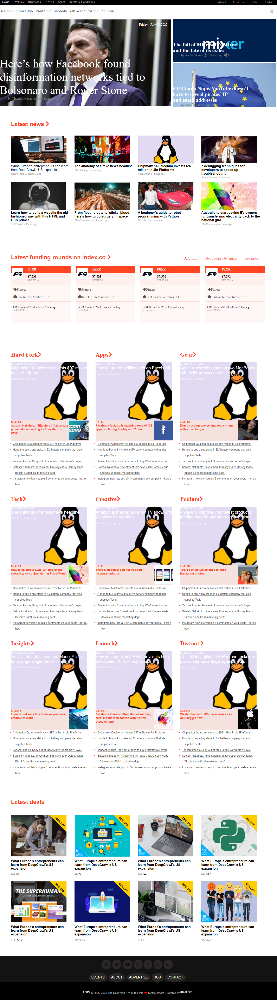

# Thenext-web

This project contains floating and positioning elements. Given colors like make it seem as professional.

## Built With

- Grids
- Flexbox
- Media queries
- Semantic HTML

## Live Demo

[Live] (https://rawcdn.githack.com/GraceOyiza/Thenext-web/6ac99a3d98b69139d379d5dd78d33443a2368097/index.html)

👤 **Author**

- Github: [@mcihadkurel](https://github.com/mcihadkurel)
- Twitter: [@mece_ka](https://twitter.com/mece_ka)
- LinkedIn: [@muhammed](https://www.linkedin.com/in/muhammed-cihad-8187581a8/)

👤 **Author**

- Github: [@GraceOyiza](https://github.com/GraceOyiza)
- Twitter: [@_PopsonGrace](https://twitter.com/_PopsonGrace)
- LinkedIn: [@grace](https://www.linkedin.com/in/grace-popoola-657a181aa/)

## 🤝 Contributing

Contributions, issues and feature requests are welcome!

Feel free to check the [issues page](issues/).

## Show your support

Give a ⭐️ if you like this project!

## Acknowledgments

- Hat tip to anyone whose code was used
- Inspiration
- etc

## 📝 License

This project has no license